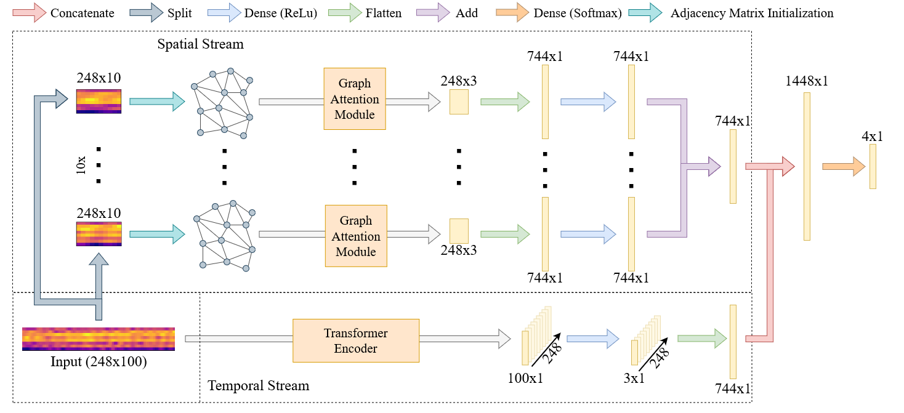

📡 Classifying MEG Data
========

This project aims to perform cross-subject multi-class classification based on MEG signals to infer the subject's state. The implemented model is a Dual Stream Graph Transformer Fusion Network, with diferent techniques for initializing the adjacency matrix. 

💻 Installation
-----

The required modules can be installed  via:

.. code:: bash

    pip install -r requirements.txt

Quick Start
~~~~~~~~~~~
To train the DS-GTF model:

.. code:: bash

    cd DS-GTF
    python Training.py  --setup 2 --epochs 15 --depth 10

.. code::

    usage: training.py [-h] [-s SETUP] [-adj {none,threshold,topk}] [-t THRESHOLD] [-k K]

    optional arguments:
    -h, --help                                                      show this help message and exit
    -s SETUP, --setup SETUP                                         Please select a number between 0 and 2 to choose the setup of the training
    -adj {none,threshold,topk}, --adjacency {none,threshold,topk}   Please choose the type of adjacency
    -t THRESHOLD, --threshold THRESHOLD                             Please choose a threshold value , by default 0.95
    -k K                                                            Please choose a K value , by default 3

.. code:: bash
    
    python evaluation.py -m top_k

.. code::

    usage: evaluation.py [-h] [-m MODEL]

    optional arguments:
    -h, --help                  show this help message and exit
    -m MODEL, --model MODEL     Please define a model
                           

📂 Data
-----

In order to download the data, please email to both of the following addresses:

l.d.goene@student.uu.nl

s.mehrkanoon@uu.nl

The data must be downloaded and unzipped in the directory defined at the bottom of *data_utils.py*, line 850.

📜 Scripts
-----

- The scripts contain the models, the data preprocessing, as well as the training and testing files.

- The training script trains the model with the subjects in the train/validate folders and saves the intermediate models and weights.

- The test script loads the pretrained model and evaluate it with the indicated subjects.

.. 🔗 Citation
.. -----

.. WIP

.. If you decide to cite our project in your paper or use our data, please use the following bibtex reference:

.. .. code:: bibtex

..   @misc{abdellaoui2020deep,
..         title={Deep brain state classification of MEG data},
..         author={Ismail Alaoui Abdellaoui and Jesús García Fernández and Caner Şahinli and Siamak Mehrkanoon},
..         year={2020},
..         eprint={2007.00897},
..         archivePrefix={arXiv},
..         primaryClass={cs.LG}
..     }
